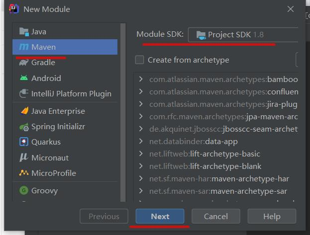
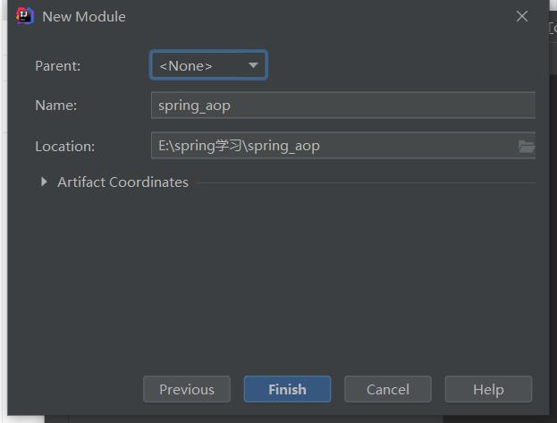
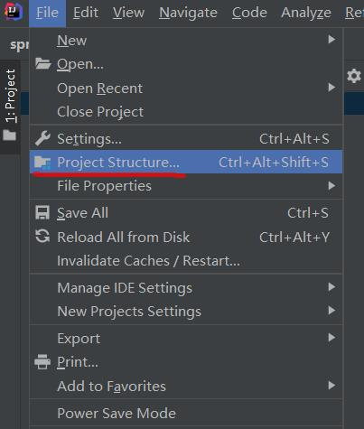
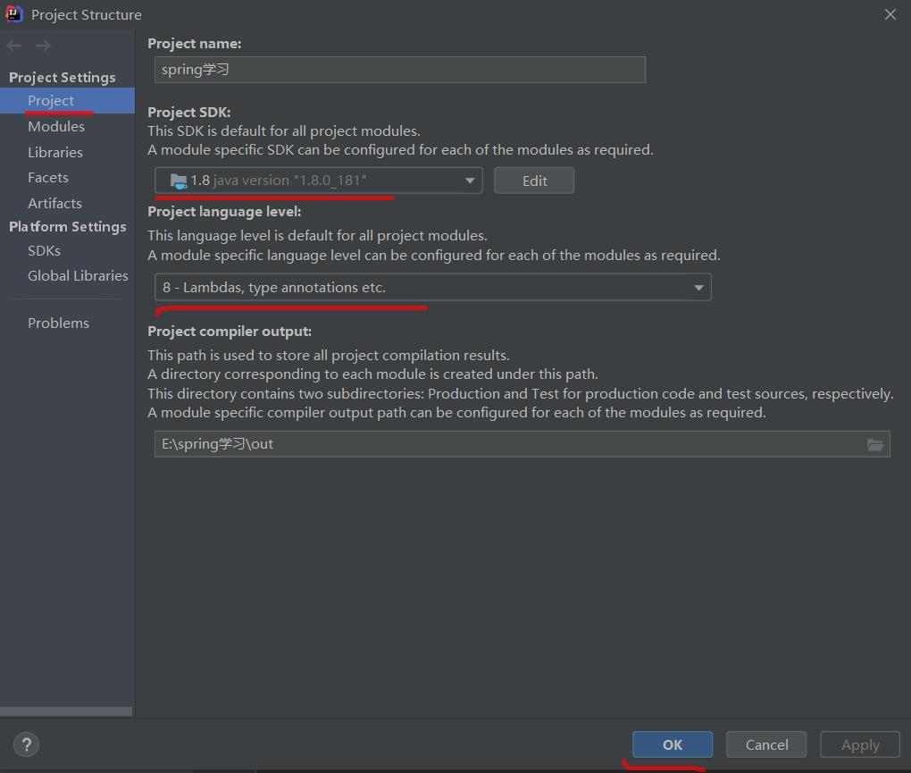
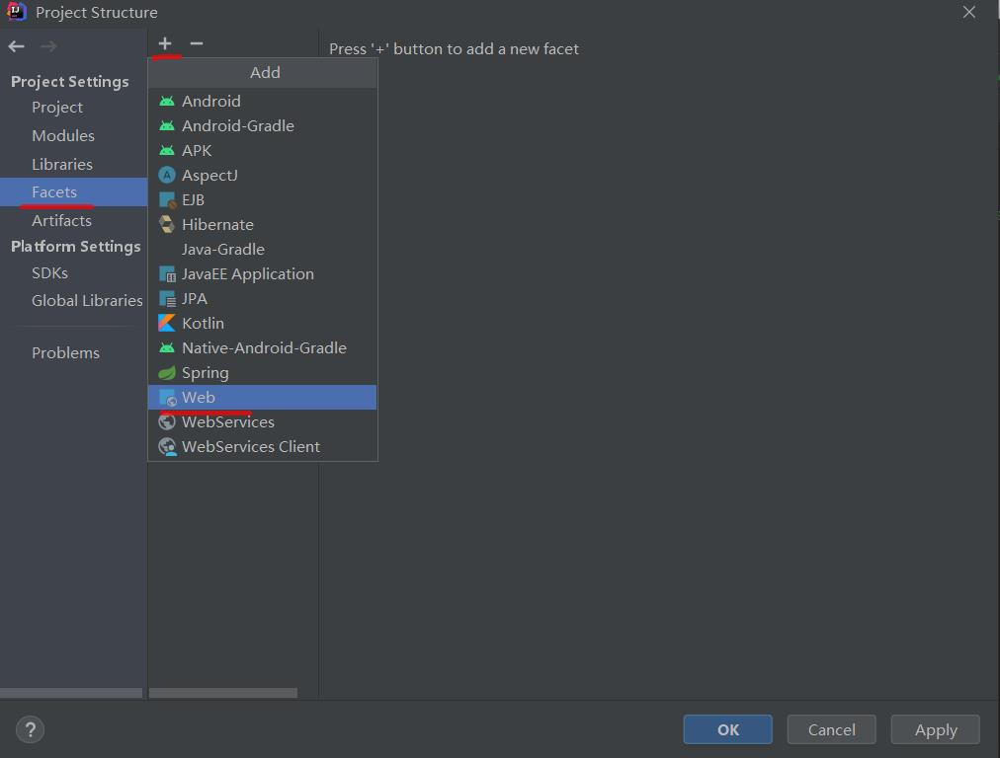
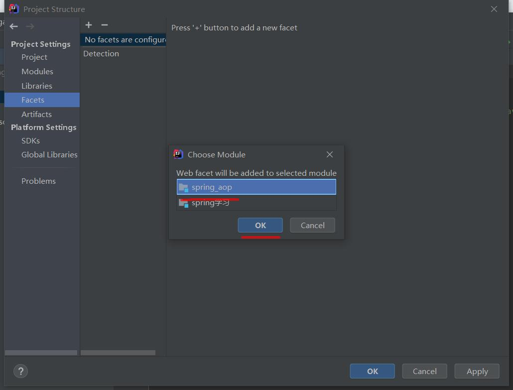
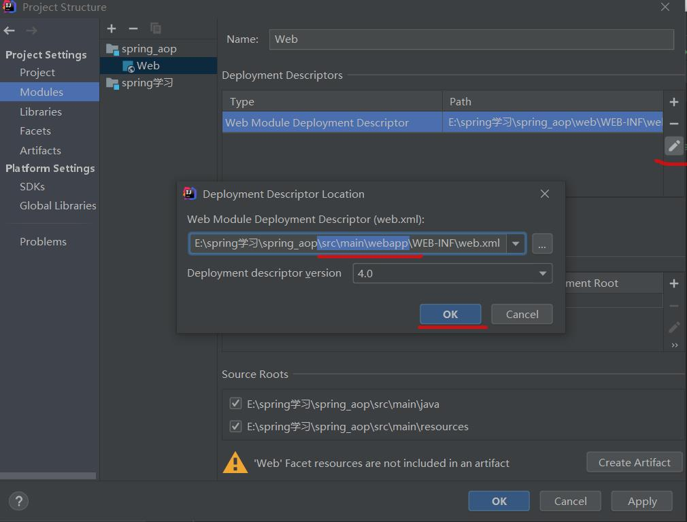
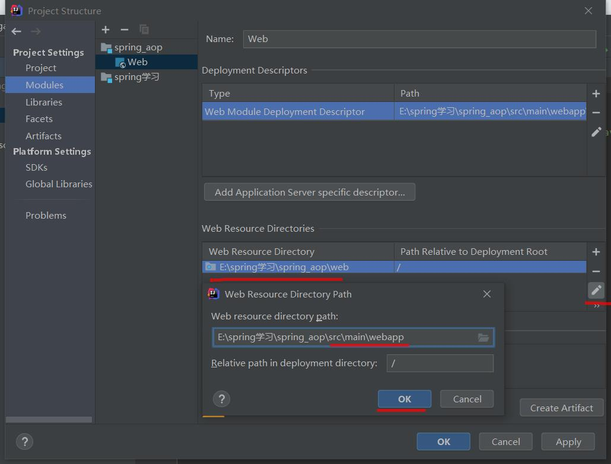

<!--
 * @Author: your name
 * @Date: 2020-11-15 09:17:35
 * @LastEditTime: 2020-11-15 10:51:37
 * @LastEditors: Please set LastEditors
 * @Description: In User Settings Edit
 * @FilePath: \studyJava\Spring\README.md
-->
# Spring框架
## spring工程搭建
  1. 在任意的地方新建文件夹，我是在E盘，然后用idea把他打开
  2. 新建一个aop的module
    * 
    * 
    * 

  3. 给这个module新建一个webapp的源文件     
    * 
    * 
    * 
    * 
    * 
    * 
  
  4. 新建一个ioc的module和aop的新建完全一样

#  [day01(spring的简介及入门)](day01/README.md)
    |
    |---- 1. Spring的简介
    |
    |---- 2. 异常的处理方式
        |---- 2.1 try...catch语句
    |
    |---- 3.处理多个异常
    |
    |---- 4.Throwable的常用方法
        |---- 4.1 String getMessage(): 原因
        |---- 4.2 String toString(): 类型和原因
        |---- 4.3 void printStackTrace()： 类型、原因和位置
        |---- 4.4 快捷键
    |
    |---- 5. finally的用法
    |
    |---- 6. 异常的分类
    |
    |---- 7.自定义异常
        |---- 7.2 自定义异常的两种方式
            |---- 7.2.1 运行时
            |---- 7.2.2 编译时
    |
    |---- 8.递归
        |---- 8.2 练习