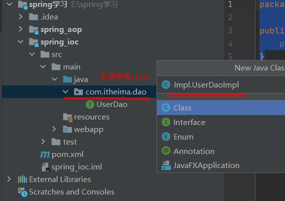

<!--
 * @Author: your name
 * @Date: 2020-11-15 10:47:12
 * @LastEditTime: 2020-11-15 14:39:48
 * @LastEditors: Please set LastEditors
 * @Description: In User Settings Edit
 * @FilePath: \studyJava\Spring\day01\README.md
-->
# Spring简介
## Sring是什么
  * Sring是分层的Java SE/EE应用full-stack轻量级开元框架，以**ioc**(Inverse Of Control: 反转控制)和**AOP**（Aspect Oriented Programming: 面向切片编程)为内核
  * 提供了展现层SpringMVC和持久层Spring JDBCTemplate以及业务事务管理等众多的企业级应用技术，还能整合开元世界众多著名的第三方框架和类库，逐渐成为使用最多的JavaEE企业应用开元框架

## Spring的优势 
  1. 方便解耦，简化开发
     * 通过Spring提供的IOC容器，可以将对象间的依赖关系交由Spring进行控制，避免应编码所造成的过度耦合，用户也不必在为单例模式类、属性文件解析等这些很底层的需求编写代码，可以更专注于上层的应用
  
  2. AOP编程的支持
     * 通过Spring的AOP功能，方便进行面向切片编程，许多不容易用传统OOP实现的功能可以通过AOP轻松实现

  3. 声明式事务的支持
     * 可以将我们从单调烦闷的事务管理代码中解脱出来，通过声明式灵活的进行事务管理，提高开发效率和质量

  4. 方便程序的测试   
     * 可以用非容器依赖的编程方式进行几乎所有的测试工作，测试不再是昂贵的操作，而是随手可做的事情

  5. 方便集成各种优秀框架
     * Spring对各种优秀框架(Struts、Hibenmate、Hessian、Qartz等)的支持

  6. 降低JavaEE API的使用难度
     * Spring对JavaEE API(如JDBC、JavaMail、远程调用等)进行了薄薄的封装层，使这些API的使用难度大为降低

  7. Java源码是经典学习典范
     * Spring的源码设计精妙、结构清晰、匠心独用，处处体现着大师对Java设计模式灵活运用以及对Java技术的高深造诣，他的源码是Java技术的最佳实践的范例

## Spring的体系结构
  * 

## Spring快速入门
  1. 导入Spring开发的基本包坐标
  2. 编写Dao接口和实现类
  3. 创建Spring核心配置文件
  4. 在Spring配置文件中配置UserDaoImpl
  5. 使用Spring的API获得Bean实例

## 用代码去实践
  1. 导入Spring开发的基本包坐标
    * 在新建的spring_ioc这个模块，点击pom.xml,并写下以下代码:
      ```
        <dependencies>
            <dependency>
                <groupId>org.springframework</groupId>
                <artifactId>spring-context</artifactId>
                <version>5.0.5.RELEASE</version>
            </dependency>
        </dependencies>
      ```

      * 
      * 注意，如果添加代码显示红色，要更新本地的maven包
        * 
        * 

  2. 编写Dao接口和实现类
       1. 在spring_ioc => src => main => java下，创建UserDao的接口
            * 
            * 写入一下代码:
              ```
                package com.itheima.dao;

                public interface UserDao {
                    public void save();
                }
              ``` 
           
       2. 在com.itheima.dao下创建接口UserDao的实现类
            * 
            * 写入以下代码:
               ```
                  package com.itheima.dao.Impl;

                  import com.itheima.dao.UserDao;

                  public class UserDaoImpl implements UserDao {
                     public void save() {
                        System.out.println("save is running...");
                     }
                  }
               ```

  3. 创建Spring核心配置文件
       1. 在resourse目录下，创建applicationContext.xml文件
            * 

  4. 在Spring配置文件中配置UserDaoImpl
       1. 写入以下代码:
         ```
            # id值随便取 class就是地址

            <bean id="userDao" class="com.itheima.dao.Impl.UserDaoImpl"></bean>
         ``` 

  5. 使用Spring的API获得Bean实例
       1. 创建一个UserDao的测试文件，创建路径在com.itheima => demo => UserDaoDemo
       2. 测试是否能获取save方法，写入以下代码:
        ```
          package com.itheima.demo;

          import com.itheima.dao.UserDao;
          import org.springframework.context.ApplicationContext;
          import org.springframework.context.support.ClassPathXmlApplicationContext;

          public class UserDaoDemo {
              public static void main(String[] args) {
                  // 方法里的参数就是xml文件名
                  ApplicationContext app = new ClassPathXmlApplicationContext("applicationContext.xml");
                  // 方法里的参数就是xml里面的id
                  UserDao userDao = (UserDao) app.getBean("userDao");
                  // 调用方法
                  userDao.save();
              }
          }
        ``` 
